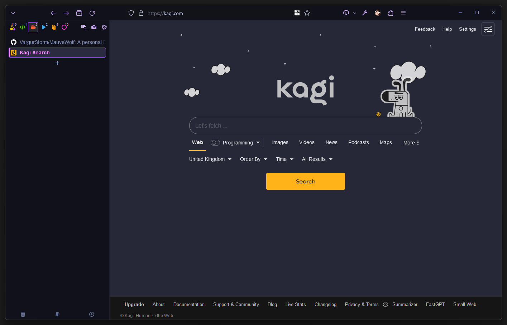

## MauveWolf, a Firefox Sidebery Theme (AKA CSS Hell)

This is my personal Firefox theme that I'm quite happy with. I built it from several different themes mixed with my own preferences.
I've had more interest than expected in my theme. I'll try and make some time soon to clean it up and publish an actual release.

### Main Changes
- Bookmark bar and tab bar hidden
- [Catpuccin](https://github.com/catppuccin/firefox) style Mauve Mocha theme with some changes
- Nav bar as part of header bar
- FireFox tab dropdown box added to the left
- Sidebery as vertical tabs without hiding (I like to see my tabs!)
- Dimmed gray unloaded tabs
- Light blue loaded tabs
- Pink bold current tab
- Custom border box for current tab
- New unread tabs in italics
- Updated and pretty Sidebery context menu
- A bunch of changes to Sidebery sizing and behaviour (double click to rename tab, unload collapsed folders, save snapshot of tabs each day and so on..)

### Windows Users

Follow the steps below, but instead of `userChrome.css`, use `userChrome - WindowsTempFix.css` and rename it to just `userChrome.css` once you've copied it into the `chrome` folder. This is to make space for the buttonbar in the top right and to stop it overlapping.
I have now resolved the bug with missing icons on the buttonbar. Please grab the latest windows userChrome until I clean this up and release a proper version.

### Updating Accent Colours

I've had two requests now around updating specific accent colours. The three places you can make such changes are:
- Your **userChrome.css** file (to directly theme the browser manually if you know what to target). [See this guide for help with that](https://www.reddit.com/r/FirefoxCSS/comments/73dvty/tutorial_how_to_create_and_livedebug_userchromecss/)
- The **sidebery CSS** where you can also use a GUI to edit (For changing tab highlights etc.)
- In [Firefox Color](https://color.firefox.com/)

### Installation
1. Go to `about:config` and set `toolkit.legacyUserProfileCustomizations.stylesheets` to "True" to enable CSS customisation.
2. Set `svg.context-properties.content.enabled` to true to allow Sidebery to use FireFox themes.
3. Install [Sidebery](https://addons.mozilla.org/en-GB/firefox/addon/sidebery/)
4. Install [Firefox Color](https://color.firefox.com/)
5. [Click to install my FireFox Color theme](https://color.firefox.com/?theme=XQAAAAJqBAAAAAAAAABBqYhm849SCicxcUd1M38oKRicm6da8pDHi8ajvXVSk7how0XG5K6BSwejFQMVPBLwKXE-jNNeM2ACdvS7L-Wxr3cCoBlZ6agKWbmlfjAucoLmnm6KCC6C4nASML-68VTMPZ7V-Tr3910_P25TunJ74NbtznlDtthN80lAknQFJjRI21Fn3xC6Pq442NWeyPyYpsp2l7LmJi4l7igH5BrTgD8y-Npju0TEjHgtrGYqQXbg7h59xvP9m2wMW2tJdpkOGysJ7-_fOmo55XJR0IQDem_LJXvsQecATkI4WVyOgG5B-2QY94OSGZXZxfhZTjDUb8qKHxVmFZYRK67Ge_qU6a6nIQ9C51xmRPrWEP4CZrE4VGGYcIMiqAT877JkeERgvZrSECkXGSR9Ov5v7Z0xIjqd6PR-pEJoX3NQbOWGJCfbpV8oqPGoPrFN4cvumDMWe_DJ6ajydJiBYCJJXyvM1uunW_AJvly4sPVjsEbTCJZ8qLA8N2YENK-xf8CS5KJmMW8cmnETw6qPb2H9C0XCMOF3m85MKybhatYaJ6dY6WnM7DgNLYqgM2fpM5q2gWPKkDhWOgT7K8HmQ4xB-7BpwFJHYmHDW0Yy_-0Ul4A)
6. Navigate to `about:support` and look for the **Profile Folder** option.
7. Inside the profile folder (Mine is called `8wu74wqf.dev-edition-default` but yours may be different) create a folder simply called `chrome`
8. Enter the `chrome` folder.
9. Drop the `userChrome.css` file in there or alternatively create your own file and paste the contents.
10. Restart Firefox and open Sidebery config/
11. In the *Help* section, click the **Import addon data** button and import `sidebery-data.json` *(NOTE: This will update your Sidebery tab panels to my list and will take your tabs out of their current panels)*
12. If you just want the styles instead and don't care about the dropdown and other config, head to the *Styles Editor* section
13. Paste my `sidebery.css` into the window on the right.
14. Done!
- *You may need to **Customise Toolbar** with a right click in Firefox to adjust positions of icons. Use the flexible spacers* :)

- Small recommendation until I can update this: Change the "Create sub-tree on opening link in new tab" to **off**. In practice this makes things much easier to manage by only creating sub-trees when you actually want them (by dragging things around).

Let me know if this breaks but I should be aware since I use this regularly. Tested on **macOS** and **Windows**. None of this CSS is clean and is full of hacks to get it working.

New tab page is [Tabliss](https://tabliss.io/)

#### Windows Version

