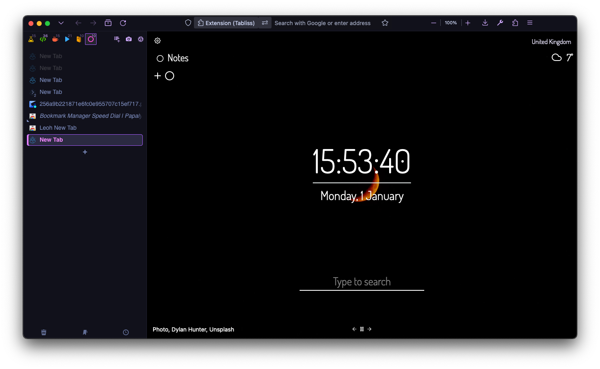
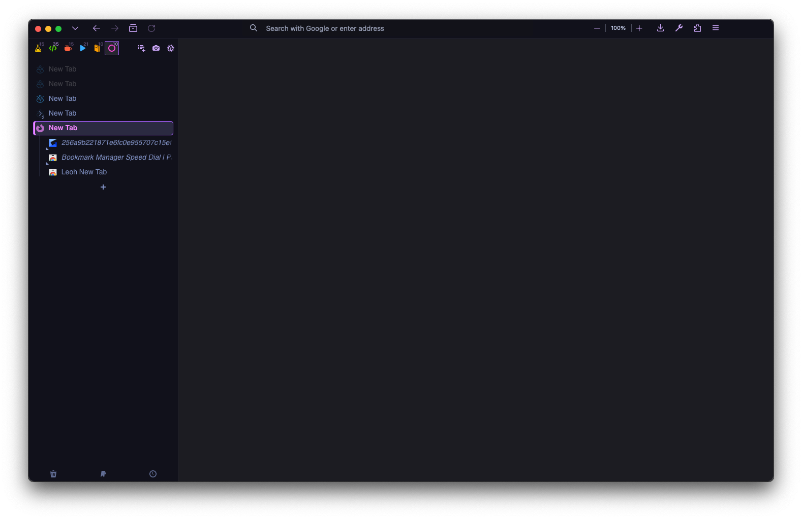

## MauveWolf (AKA CSS Hell)

This is my personal theme that I'm quite happy with. I built it from several different themes mixed with my own preferences. 

### Main Changes
- Bookmark bar and tab bar hidden
- [Catpuccin](https://github.com/catppuccin/firefox) style Mauve Mocha theme with some changes
- Nav bar as part of header bar
- FireFox tab dropdown box added to the left
- Sidebery as vertical tabs without hiding (I like to see my tabs!)
- Dimmed gray unloaded tabs
- Light blue loaded tabs
- Pink bold current tab
- Custom border box for current tab
- New unread tabs in italics
- Updated and pretty Sidebery context menu
- A bunch of changes to Sidebery sizing and behaviour (double click to rename tab, unload collapsed folders, save snapshot of tabs each day and so on..)

### Installation
1. Go to `about:config` and set `toolkit.legacyUserProfileCustomizations.stylesheets` to "True" to enable CSS customisation.
2. Set `svg.context-properties.content.enabled` to true to allow Sidebery to use FireFox themes.
3. Install [Sidebery](https://addons.mozilla.org/en-GB/firefox/addon/sidebery/)/
4. Install [FireFox Color](https://color.firefox.com/)/
5. [Click to install my FireFox Color theme](https://color.firefox.com/?theme=XQAAAAJqBAAAAAAAAABBqYhm849SCicxcUd1M38oKRicm6da8pDHi8ajvXVSk7how0XG5K6BSwejFQMVPBLwKXE-jNNeM2ACdvS7L-Wxr3cCoBlZ6agKWbmlfjAucoLmnm6KCC6C4nASML-68VTMPZ7V-Tr3910_P25TunJ74NbtznlDtthN80lAknQFJjRI21Fn3xC6Pq442NWeyPyYpsp2l7LmJi4l7igH5BrTgD8y-Npju0TEjHgtrGYqQXbg7h59xvP9m2wMW2tJdpkOGysJ7-_fOmo55XJR0IQDem_LJXvsQecATkI4WVyOgG5B-2QY94OSGZXZxfhZTjDUb8qKHxVmFZYRK67Ge_qU6a6nIQ9C51xmRPrWEP4CZrE4VGGYcIMiqAT877JkeERgvZrSECkXGSR9Ov5v7Z0xIjqd6PR-pEJoX3NQbOWGJCfbpV8oqPGoPrFN4cvumDMWe_DJ6ajydJiBYCJJXyvM1uunW_AJvly4sPVjsEbTCJZ8qLA8N2YENK-xf8CS5KJmMW8cmnETw6qPb2H9C0XCMOF3m85MKybhatYaJ6dY6WnM7DgNLYqgM2fpM5q2gWPKkDhWOgT7K8HmQ4xB-7BpwFJHYmHDW0Yy_-0Ul4A)/
6. Navigate to `about:support` and look for the **Profile Folder** option.
7. Inside the profile folder (Mine is called `8wu74wqf.dev-edition-default` but yours may be different) create a folder simply called `chrome`/
8. Enter the `chrome` folder.
9. Drop the `userChrome.css` file in there or alternatively create your own file and paste the contents.
10. Restart FireFox and open Sidebery config/
11. In the *Help* section, click the **Import addon data** button and import `sidebery-data.json`/
12. If you just want the styles instead and don't care about the dropdown and other config, head to the *Styles Editor* section
13. Paste my `sidebery.css` into the window on the right.
14. Done!

*You may need to **Customise Toolbar** with a right click in FireFox to adjust positions of icons. Use the flexible spacers :)

Let me know if this breaks but I should be aware since I use this regularly. Tested on macOS and Windows (soon). None of this CSS is clean and is full of hacks to get it working.

New tab page is [Tabliss](https://tabliss.io/)

